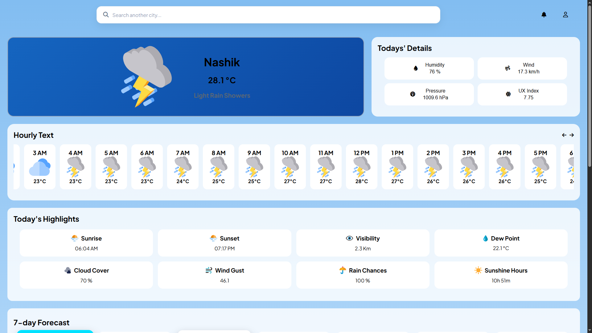
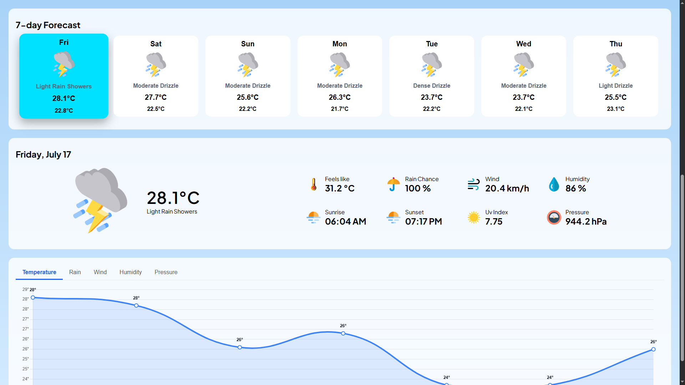

# 🌦️ Weather Dashboard

A modern and responsive Weather Dashboard built using **HTML**, **CSS**, and **Vanilla JavaScript**. The application provides real-time weather information along with hourly and 7-day forecasts using the Open-Meteo API. The interface is designed with a clean, glassmorphism-inspired UI and focuses on simplicity, responsiveness, and user experience.

---

## 📸 Preview




## ✨ Features

- 🔍 Search weather by city
- 🌡️ Current temperature and weather condition
- ⏰ 24-Hour weather forecast
- 📅 7-Day weather forecast
- 🌅 Sunrise & Sunset timings
- 💧 Humidity
- 🌬️ Wind Speed & Wind Gust
- 🌧️ Rain Probability
- 👀 Visibility
- 🌤️ UV Index
- 🌡️ Feels Like Temperature
- ☁️ Cloud Cover
- 💦 Dew Point
- 📈 Interactive weather charts using Chart.js
- 🎨 Dynamic weather icons
- 📱 Fully Responsive Design

---

## 🛠️ Built With

- HTML5
- CSS3
- JavaScript (ES6)
- Open-Meteo API
- OpenStreetMap (Geocoding)
- Chart.js

---

## 📂 Folder Structure

```
Weather_App_Web/
│
├── style.css
│
│
├── script.js
│
│
├── svg/
│
│
├── index.html
└── README.md
```

---

## 🚀 Getting Started

### Clone the Repository

```bash
git clone https://github.com/bharambepratik08-star/Weather_App_Web.git
```

### Open Project

Simply open **index.html** in your browser.

Or use VS Code Live Server.

---

## 🌐 APIs Used

### Open-Meteo

- Current Weather
- Hourly Forecast
- 7-Day Forecast

https://open-meteo.com/

### OpenStreetMap Nominatim

- City Search
- Geocoding

https://nominatim.openstreetmap.org/

---

## 📊 Weather Information Displayed

- Current Temperature
- Weather Description
- Feels Like
- Humidity
- Pressure
- UV Index
- Wind Speed
- Wind Gust
- Rain Chance
- Visibility
- Cloud Cover
- Dew Point
- Sunrise
- Sunset
- Hourly Forecast
- Weekly Forecast
- Temperature Graph

---

## 🎯 Future Improvements

- 🌙 Dark Mode
- ⭐ Favorite Cities
- 🌎 Multiple Language Support
- 🔔 Weather Alerts
- 📍 Interactive Weather Map
- 📅 Calendar Forecast
- 🌪️ Air Quality Index
- 📡 PWA Support

---

## 💡 What I Learned

During this project I learned:

- Working with REST APIs
- Fetch API & Async JavaScript
- DOM Manipulation
- Responsive Web Design
- CSS Flexbox & Grid
- Dynamic UI Rendering
- Working with Weather Data
- Chart.js Integration
- API Error Handling
- Clean UI Design Principles

---

## 👨‍💻 Author

**Pratik Bharambe**

GitHub:
https://github.com/bharambepratik08-star

---

## ⭐ Support

If you like this project, consider giving it a ⭐ on GitHub.
